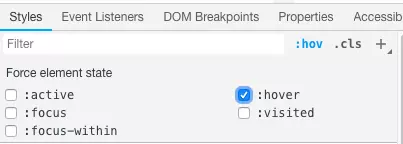
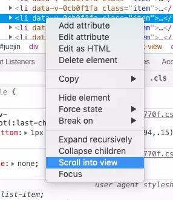
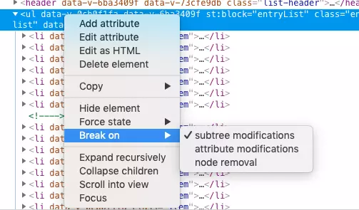
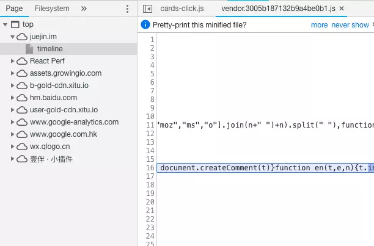
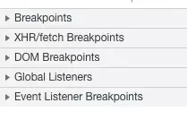
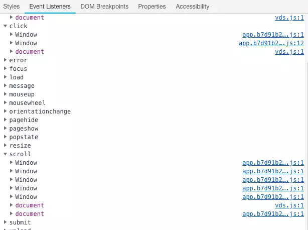
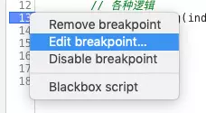

# 前端面试之道

## DevTools Tips

这一章节的内容可能和面试没有太大关系，但是如果你能很好地使用 DevTools 的话，它能够很好地帮助你提高生产力和解决问题的能力。在这一章节中，我不会去介绍大家经常使用的功能，重点在于让大家学习到一些使用 DevTools 的技巧。

### Elements


这个功能肯定是大家经常用到的，我们可以通过它来可视化所有的 DOM 标签，可以查看任何 DOM 的属性，接下来我们就来学习一下关于这方面的 Tips。

#### Element 状态

你可能会在开发中遇到这么一个场景：给一个 a 标签设置了多种状态下的样式，但是如果手动去改变状态的话就有点麻烦，这时候这个 Tips 就能帮你解决这个问题。



可以从上图中看到，无论你想看到元素的何种状态下的样式，都只需要勾选相对应的状态就可以了，这是不是比手动更改方便多了？

#### 快速定位 Element

通常页面都是可以滚动的，那么如果想查看的元素不在当前窗口的话，你还需要滚动页面才能找到元素，这时候这个 Tips 就能帮你解决这个问题。



当点击这个选项的时候，页面就会自动滚动到元素所在的位置，这样比边滚动边查看是否找到元素的方式方便多了。

### DOM 断点

给 JS 打断点想必各位都听过，但是 DOM 断点知道的人应该就少了。如果你想查看一个 DOM 元素是如何通过 JS 更改的，你就可以使用这个功能。



当我们给 `ul` 添加该断点以后，一旦 `ul` 子元素发生了改动，比如说增加了子元素的个数，那么就会自动跳转到对应的 JS 代码



其实不光可以给 DOM 打断点，我们还可以给 Ajax 或者 Event Listener 打断点。



### 查看事件

我们还可以通过 DevTools 来查看页面中添加了多少的事件。假如当你发现页面滚动起来有性能上的问题时，就可以查看一下有多少 scroll 事件被添加了



### 找到之前查看过的 DOM 元素

不知道你是否遇到过这样的问题，找不到之前查看过的 DOM 元素在哪里了，需要一个个去找这就有点麻烦了，这时候你就可以使用这个功能。


我们可以通过 $0 来找到上一次查看过的 DOM 元素，$1 就是上上次的元素，之后以此类推。这时候你可能会说，打印出来元素有啥用，在具体什么位置还要去找啊，不用急，马上我就可以解决这个问题


当你点击这个选项时，页面立马会跳转至元素所在位置，并且 DevTools 也会变到 Elements 标签。

### Debugging

给 JS 打断点想必大家都会，但是打断点也是有一个不为人知的 Tips 的。

```js
for (let index = 0; index < 10; index++) {
  // 各种逻辑
  console.log(index)
}
```

对于这段代码来说，如果我只想看到 `index` 为 `5` 时相应的断点信息，但是一旦打了断点，就会每次循环都会停下来，很浪费时间，那么通过这个小技巧我们就可以圆满解决这个问题



首先我们先右键断点，然后选择 `Edit breakpoint...` 选项


在弹框内输入 `index === 5`，这样断点就会变为橙色，并且只有当符合表达式的情况时断点才会被执行


### 小结

虽然这一章的内容并不多，但是涉及到的几个场景都是日常经常会碰到的，希望这一章节的内容会对大家有帮助。如果大家对于这个章节的内容存在疑问，欢迎在评论区与我互动。