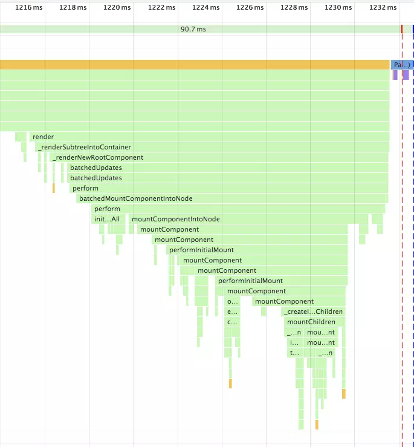
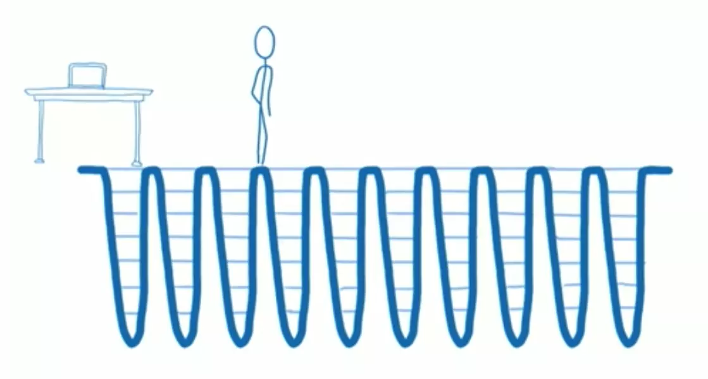

# 前端面试之道

## React 常考基础知识点

这一章节我们将来学习 React 的一些经常考到的基础知识点。

### 生命周期

在 V16 版本中引入了 Fiber 机制。这个机制一定程度上的影响了部分生命周期的调用，并且也引入了新的 2 个 API 来解决问题，关于 Fiber 的内容将会在下一章节中讲到。

在之前的版本中，如果你拥有一个很复杂的复合组件，然后改动了最上层组件的 state，那么调用栈可能会很长



调用栈过长，再加上中间进行了复杂的操作，就可能导致长时间阻塞主线程，带来不好的用户体验。Fiber 就是为了解决该问题而生。

Fiber 本质上是一个虚拟的堆栈帧，新的调度器会按照优先级自由调度这些帧，从而将之前的同步渲染改成了异步渲染，在不影响体验的情况下去分段计算更新。



对于如何区别优先级，React 有自己的一套逻辑。对于动画这种实时性很高的东西，也就是 16 ms 必须渲染一次保证不卡顿的情况下，React 会每 16 ms（以内） 暂停一下更新，返回来继续渲染动画。

对于异步渲染，现在渲染有两个阶段：`reconciliation` 和 `commit`。前者过程是可以打断的，后者不能暂停，会一直更新界面直到完成。

Reconciliation 阶段

- `componentWillMount`。
- `componentWillReceiveProps`。
- `shouldComponentUpdate`。
- `componentWillUpdate`。

Commit 阶段

- `componentDidMount`。
- `componentDidUpdate`。
- `componentWillUnmount`。

因为 Reconciliation 阶段是可以被打断的，所以 Reconciliation 阶段会执行的生命周期函数就可能会出现调用多次的情况，从而引起 Bug。由此对于 Reconciliation 阶段调用的几个函数，除了 `shouldComponentUpdate` 以外，其他都应该避免去使用，并且 V16 中也引入了新的 API 来解决这个问题。

`getDerivedStateFromProps` 用于替换 `componentWillReceiveProps`，该函数会在初始化和 `update` 时被调用

```js
class ExampleComponent extends React.Component {
  // Initialize state in constructor,
  // Or with a property initializer.
  state = {};

  static getDerivedStateFromProps(nextProps, prevState) {
    if (prevState.someMirroredValue !== nextProps.someValue) {
      return {
        derivedData: computeDerivedState(nextProps),
        someMirroredValue: nextProps.someValue
      };
    }

    // Return null to indicate no change to state.
    return null;
  }
}
```

`getSnapshotBeforeUpdate` 用于替换 `componentWillUpdate`，该函数会在 `update` 后 DOM 更新前被调用，用于读取最新的 DOM 数据。

### setState

setState 在 React 中是经常使用的一个 API，但是它存在一些的问题经常会导致初学者出错，核心原因就是因为这个 API 是异步的。

首先 setState 的调用并不会马上引起 state 的改变，并且如果你一次调用了多个 setState ，那么结果可能并不如你期待的一样。

```js
handle() {
  // 初始化 `count` 为 0
  console.log(this.state.count) // -> 0
  this.setState({ count: this.state.count + 1 })
  this.setState({ count: this.state.count + 1 })
  this.setState({ count: this.state.count + 1 })
  console.log(this.state.count) // -> 0
}
```

第一，两次的打印都为 0，因为 `setState` 是个异步 API，只有同步代码运行完毕才会执行。`setState` 异步的原因我认为在于，`setState` 可能会导致 DOM 的重绘，如果调用一次就马上去进行重绘，那么调用多次就会造成不必要的性能损失。设计成异步的话，就可以将多次调用放入一个队列中，在恰当的时候统一进行更新过程。

第二，虽然调用了三次 `setState`，但是 `count` 的值还是为 1。因为多次调用会合并为一次，只有当更新结束后 `state` 才会改变，三次调用等同于如下代码

```js
Object.assign(  
  {},
  { count: this.state.count + 1 },
  { count: this.state.count + 1 },
  { count: this.state.count + 1 },
)
```

当然你也可以通过以下方式来实现调用三次 `setState` 使得 `count` 为 3

```js
handle() {
  this.setState((prevState) => ({ count: prevState.count + 1 }))
  this.setState((prevState) => ({ count: prevState.count + 1 }))
  this.setState((prevState) => ({ count: prevState.count + 1 }))
}
```

如果你想在每次调用 `setState` 后获得正确的 `state`，可以通过如下代码实现

```js
handle() {
    this.setState((prevState) => ({ count: prevState.count + 1 }), () => {
        console.log(this.state)
    })
}
```

### 性能优化

这小节内容集中在组件的性能优化上，这一方面的性能优化也基本集中在 `shouldComponentUpdate` 这个钩子函数上做文章。

> PS：下文中的 state 指代了 state 及 props。

在 `shouldComponentUpdate` 函数中我们可以通过返回布尔值来决定当前组件是否需要更新。这层代码逻辑可以是简单地浅比较一下当前 `state` 和之前的 `state` 是否相同，也可以是判断某个值更新了才触发组件更新。一般来说不推荐完整地对比当前 `state` 和之前的 `state` 是否相同，因为组件更新触发可能会很频繁，这样的完整对比性能开销会有点大，可能会造成得不偿失的情况。

当然如果真的想完整对比当前 `state` 和之前的 `state` 是否相同，并且不影响性能也是行得通的，可以通过 `immutable` 或者 `immer` 这些库来生成不可变对象。这类库对于操作大规模的数据来说会提升不错的性能，并且一旦改变数据就会生成一个新的对象，对比前后 `state` 是否一致也就方便多了，同时也很推荐阅读下 `immer` 的源码实现。

另外如果只是单纯的浅比较一下，可以直接使用 `PureComponent`，底层就是实现了浅比较 `state`。

```js
class Test extends React.PureComponent {
  render() {
    return (
      <div>
        PureComponent
      </div>
    )
  }
}
```

这时候你可能会考虑到函数组件就不能使用这种方式了，如果你使用 16.6.0 之后的版本的话，可以使用 `React.memo` 来实现相同的功能。

```js
const Test = React.memo(() => (
    <div>
        PureComponent
    </div>
))
```

通过这种方式我们就可以既实现了 `shouldComponentUpdate` 的浅比较，又能够使用函数组件。

### 通信

其实 React 中的组件通信基本和 Vue 中的一致。同样也分为以下三种情况：

- 父子组件通信。
- 兄弟组件通信。
- 跨多层级组件通信。
- 任意组件。

#### 父子通信

父组件通过 `props` 传递数据给子组件，子组件通过调用父组件传来的函数传递数据给父组件，这两种方式是最常用的父子通信实现办法。

这种父子通信方式也就是典型的单向数据流，父组件通过 `props` 传递数据，子组件不能直接修改 `props`， 而是必须通过调用父组件函数的方式告知父组件修改数据。

#### 兄弟组件通信

对于这种情况可以通过共同的父组件来管理状态和事件函数。比如说其中一个兄弟组件调用父组件传递过来的事件函数修改父组件中的状态，然后父组件将状态传递给另一个兄弟组件。

#### 跨多层次组件通信

如果你使用 16.3 以上版本的话，对于这种情况可以使用 Context API。

```js
// 创建 Context，可以在开始就传入值
const StateContext = React.createContext()
class Parent extends React.Component {
  render () {
    return (
      // value 就是传入 Context 中的值
      <StateContext.Provider value='yck'>
        <Child />
      </StateContext.Provider>
    )
  }
}
class Child extends React.Component {
  render () {
    return (
      <ThemeContext.Consumer>
        // 取出值
        {context => (
          name is { context }
        )}
      </ThemeContext.Consumer>
    );
  }
}
```

#### 任意组件

这种方式可以通过 Redux 或者 Event Bus 解决，另外如果你不怕麻烦的话，可以使用这种方式解决上述所有的通信情况。

### 小结

总的来说这一章节的内容更多的偏向于 React 的基础，另外 React 的面试题还会经常考到 Virtual DOM 中的内容，所以这块内容大家也需要好好准备。

下一章节我们将来了解一些 React 的进阶知识内容。


